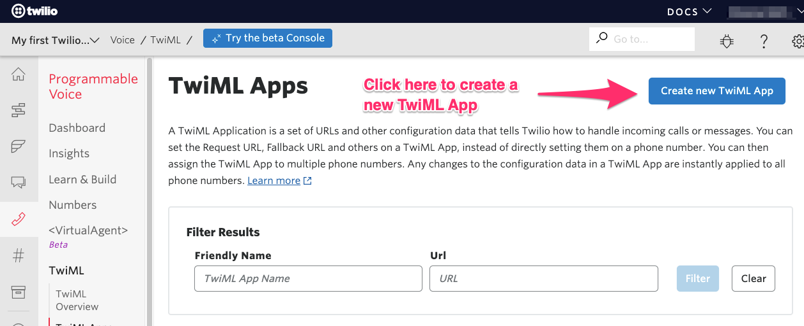
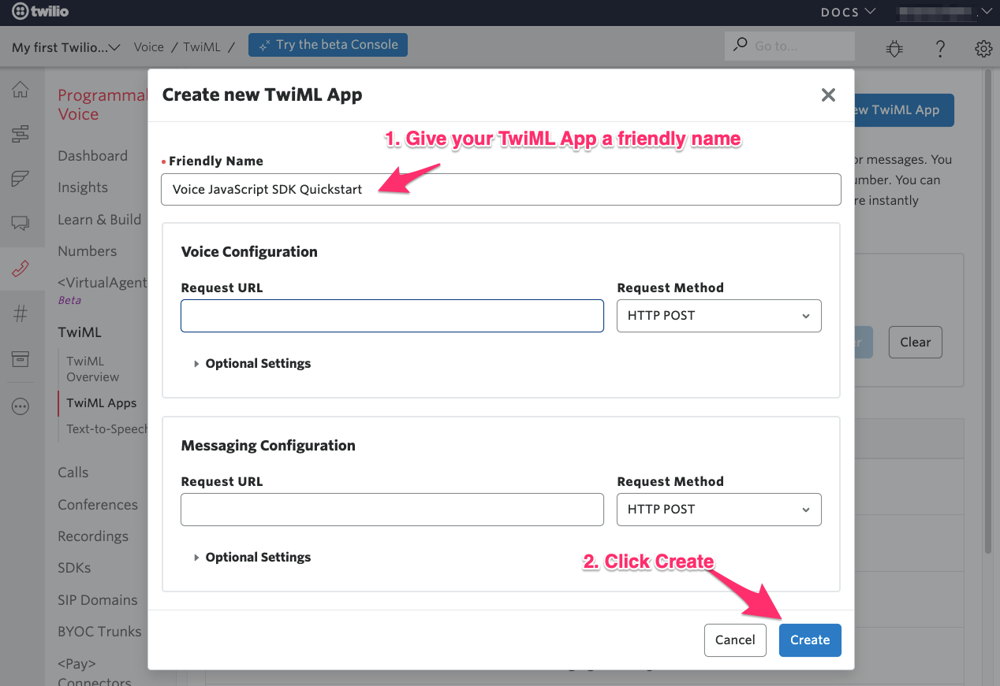
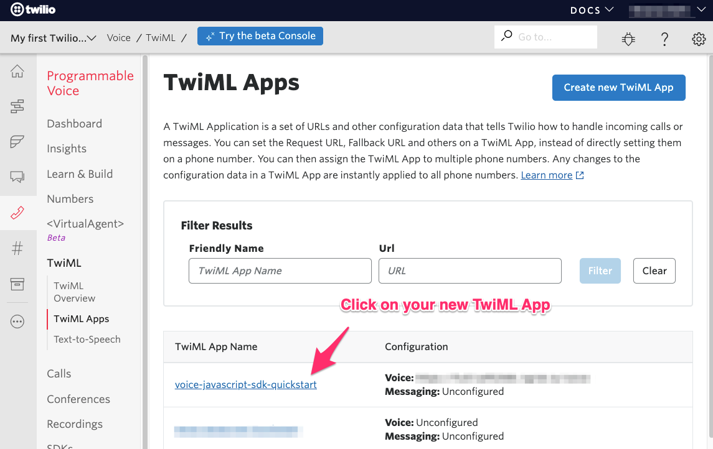
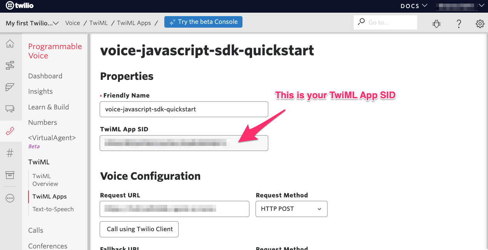

# Create a new TwiML App

1. Log in to your [Twilio Console](https://www.twilio.com/console)

2. Navigate to [Programmable Voice > TwiML > TwiML Apps](https://www.twilio.com/console/voice/twiml/apps) 

3. Click on the "Create new TwiML App" button in the top right corner. 

4. Give your TwiML App a friendly name and click 'Create'.

5. Click on your new TwiML App in the list of TwiML Apps.

6. Find your TwiML App's SID. You will need this to configure your project.

