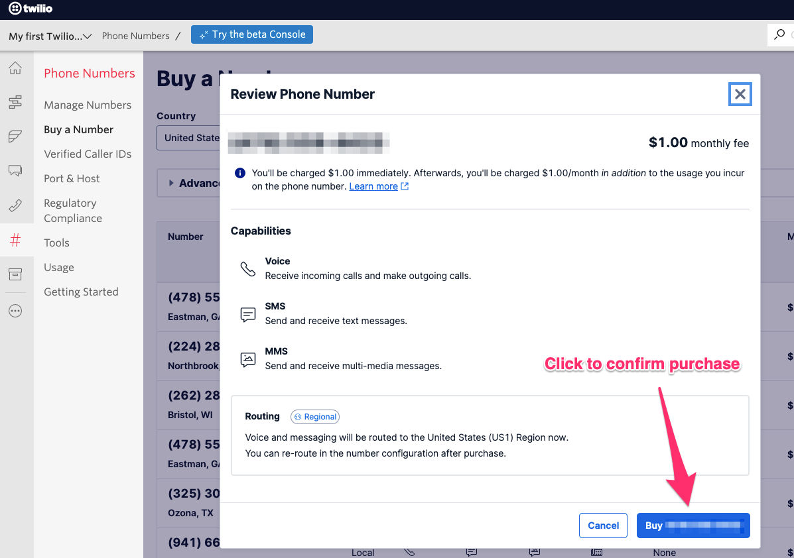

# Buy a Voice Phone Number

1. Log in to your [Twilio Console](https://www.twilio.com/console)

2. Navigate to [Phone Numbers](https://www.twilio.com/console/phone-numbers/incoming)

3. Click on the 'Buy a number' button in the top right corner.

4. On the 'Buy a Number' screen, select 'Voice' under capabilities, then click 'Search'.

5. Choose a phone number and click 'Buy'.

6. On the 'Review Phone Number' modal, click 'Buy (XXX) XXX-XXXX' button in bottom right.

