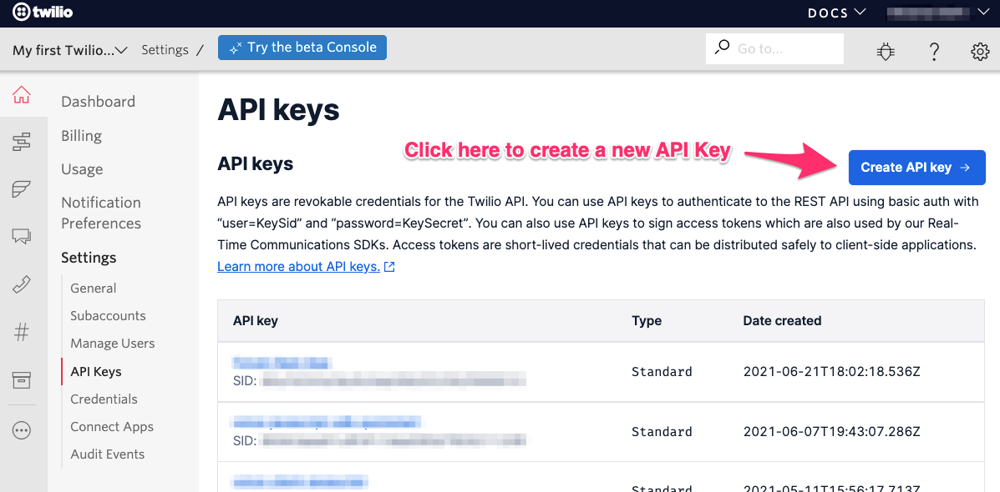
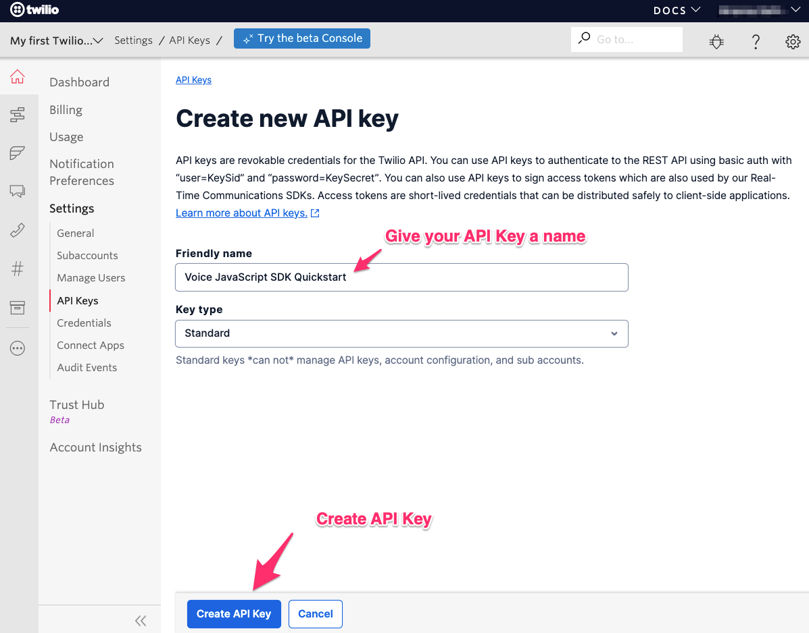
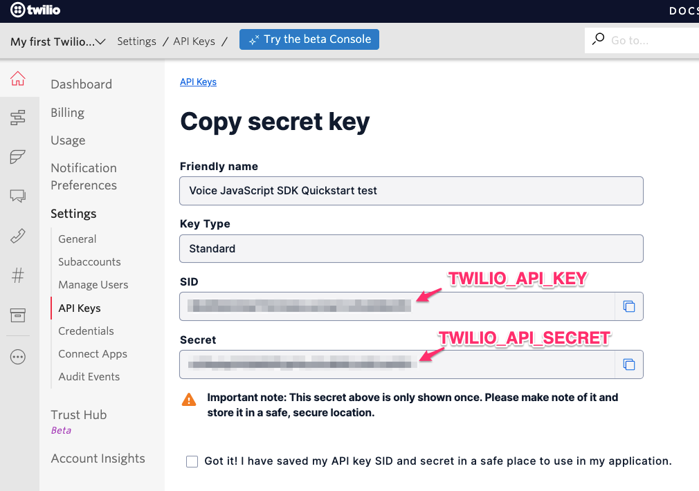

# Create an API Key

1. Log in to your [Twilio Console](https://www.twilio.com/console)

2. Navigate to [Settings > API Keys](https://www.twilio.com/console/project/api-keys).

3. On the API Keys screen, click on the 'Create API Key' button in the top right corner.

4. Give your API Key a Friendly Name and click the 'Create API Key' Button.

5. On the 'Copy secret key' page, copy the SID and the Secret. The SID will be the `TWILIO_API_KEY` in your `.env` file. The Secret will be the `TWILIO_API_SECRET` in your `.env` file. You will only see the Secret on this screen, so you must copy it and keep it in a safe location.

