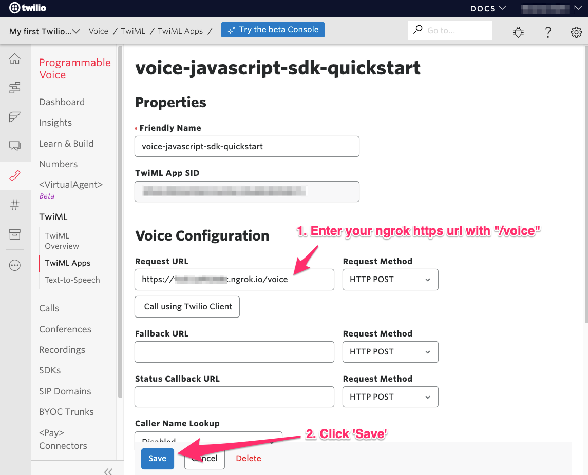
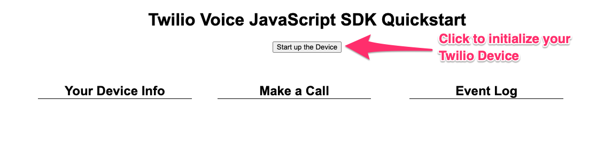

<a href="https://www.twilio.com">
  
</a>

# Twilio Voice JavaScript SDK Quickstart for Node.js


> This template is part of Twilio CodeExchange. If you encounter any issues with this code, please open an issue at [github.com/twilio-labs/code-exchange/issues](https://github.com/twilio-labs/code-exchange/issues).

## About

This application should give you a ready-made starting point for writing your own voice apps with Twilio Voice JavaScript SDK 2.0 (Formerly known as Twilio Client). 

This application is built in Node.

Implementations in other languages:

| .NET        | Java        | Python                                                                        | PHP         | Ruby        |
| :---------- | :---------- | :---------------------------------------------------------------------------- | :---------- | :---------- |
| [Done](https://github.com/TwilioDevEd/voice-javascript-sdk-quickstart-csharp) | [Done](https://github.com/TwilioDevEd/voice-javascript-sdk-quickstart-java)| [Done](https://github.com/TwilioDevEd/voice-javascript-sdk-quickstart-python) | [Done](https://github.com/TwilioDevEd/voice-javascript-sdk-quickstart-php) | [Done](https://github.com/TwilioDevEd/voice-javascript-sdk-quickstart-ruby) |

## Set Up

### Requirements

- [Nodejs](https://nodejs.org/) version **14.0** or above.
- [ngrok](https://ngrok.com/download) - this is used to expose your local development server to the internet. For more information, read [this Twilio blog post](https://www.twilio.com/blog/2015/09/6-awesome-reasons-to-use-ngrok-when-testing-webhooks.html).
- A WebRTC enabled browser (Google Chrome or Mozilla Firefox are recommended). Edge and Internet Explorer will not work for testing.

### Create a TwiML Application, Purchase a Phone Number, Create an API Key

1. [Create a TwiML Application in the Twilio Console](https://www.twilio.com/console/voice/twiml/apps). Once you create the TwiML Application, click on it in your list of TwiML Apps to find the TwiML App SID. You will need this SID for your `.env` file. **Note:** You will need to configure the Voice "REQUEST URL" in your TwiML App later.

   - For detailed instructions with screenshots, see the [Create a TwiML App.md file](ConsoleHowTos/CreateNewTwiMLApp/CreateNewTwiMLApp.md)
 
2. [Purchase a Voice phone number](https://www.twilio.com/console/phone-numbers/incoming). You will need this phone number in [E.164 format](https://en.wikipedia.org/wiki/E.164) for your `.env` file.
   
   - For detailed instructions with screenshots, see the [Buy a Phone Number.md file](ConsoleHowTos/BuyVoicePhoneNumber/BuyVoicePhoneNumber.md)
   
3. [Create an API Key in the Twilio Console](https://www.twilio.com/console/project/api-keys). Keep the API Key SID and the API Secret in a safe place, since you will need them for your `.env` file. Your API KEY is needed to create an [Access Token](https://www.twilio.com/docs/iam/access-tokens).

   - For detailed instructions with screenshots, see the [Create an API Key.md file](ConsoleHowTos/CreateAPIKey/CreateAPIKey.md)

### Gather Config Values

Before we begin local development, we need to collect all the config values we need to run the application.

| Config Value                           | Description                                                                                                                                                              |
| :------------------------------------- | :----------------------------------------------------------------------------------------------------------------------------------------------------------------------- |
| `TWILIO_ACCOUNT_SID`                   | Your primary Twilio account identifier - find this [in the console here](https://www.twilio.com/console).                                                                |
| `TWILIO_TWIML_APP_SID`                 | The SID of the TwiML App you created in step 1 above. Find the SID [in the console here](https://www.twilio.com/console/voice/twiml/apps).                               |
| `TWILIO_CALLER_ID`                     | Your Twilio phone number in [E.164 format](https://en.wikipedia.org/wiki/E.164) - you can [find your number here](https://www.twilio.com/console/phone-numbers/incoming) |
| `TWILIO_API_KEY` / `TWILIO_API_SECRET` | The `TWILIO_API_KEY` is the API Key SID you created in step 3 above, and the `TWILIO_API_SECRET` is the secret associated with that key.                                 |

### Local development

1. First clone this repository and cd into it:

   ```bash
   git clone https://github.com/TwilioDevEd/voice-javascript-sdk-quickstart-node.git
   cd voice-javascript-sdk-quickstart-node
   ```

2. Create a configuration file for your application by copying the `.env.example` and edit the `.env` file with the configuration values from above.

   ```bash
   cp .env.example .env
   ```

3. Install the dependencies.

   ```bash
   npm install
   ```

4. Copy the `twilio.min.js` file from your `node_modules` to your `public` directory. Run the following from the root directory of your project: 

   ```bash
   cp node_modules/@twilio/voice-sdk/dist/twilio.min.js public
   ```
   **Note:** In order to keep this quickstart as simple as possible, this step is used to avoid any need for build tools like Webpack.

5. Launch local development web server.

   ```bash
   npm start
   ```

6. Navigate to [http://localhost:3000](http://localhost:3000) in your browser.

7. Expose your application to the wider internet using `ngrok`. This step is **crucial** for the app to work as expected.

   ```bash
   ngrok http 3000
   ```

8. `ngrok` will assign a unique URL to your tunnel.
   It might be something like `https://asdf456.ngrok.io`. You will need this to configure your TwiML app in the next step.

9. Configure your TwiML app

   - In the Twilio Console, navigate to [Programmable Voice > TwiML > TwiML Apps](https://www.twilio.com/console/voice/twiml/apps)
   - Select the TwiML App you created earlier
   - On your TwiML App's information page, find the 'Voice Configuration' section.
   - Change the Request URL to your ngrok url with `/voice` appended to the end. (E.g: `https://asdf456.ngrok.io/voice`) **Note:** You **must** use the https URL, otherwise some browsers will block
     microphone access.
   - Click the 'Save' button.

   

You should now be ready to make and receive calls from your browser.

## Your Web Application

When you navigate to `localhost:3000`, you should see the web application containing a 'Start up the Device' button. Click this button to initialize a `Twilio.Device`.



When the `Twilio.Device` is initialized, you will be assigned a random "client name", which will appear in the 'Device Info' column on the left side of the page. This client name is used as the `identity` field when generating an Access Token for the `Twilio.Device`, and is also used to route SDK-to-SDK calls to the correct `Twilio.Device`.

### To make an outbound call to a phone number:

- Under 'Make a Call', enter a phone number in [E.164 format](https://en.wikipedia.org/wiki/E.164) and press the 'Call' button

### To make a browser-to browser call:

Open two browser windows to `localhost:3000` and click 'Start up the Device' button in both windows. You should see a different client name in each window.

Enter one client's name in the other client's 'Make a Call' input and press the 'Call' button.


### Receiving Incoming Calls from a Non-Browser Device

You will first need to configure your Twilio Voice Phone Number to use the TwiML App we created earlier. This tells Twilio how to handle an incoming call directed to your Twilio Voice Number.

1.  Log in to your [Twilio Console](https://www.twilio.com/console)
2.  Navigate to your [Active Numbers list](https://www.twilio.com/console/phone-numbers/incoming)
3.  Click on the number you purchased earlier
4.  Scroll down to find the 'Voice & Fax' section and look for 'CONFIGURE WITH'
5.  Select 'TwiML' App
6.  Under 'TWIML APP', choose the TwiML App you created earlier.
7.  Click the 'Save' button at the bottom of the browser window.


You can now call your Twilio Voice Phone Number from your cell or landline phone.

**Note:** Since this is a quickstart with limited functionality, incoming calls will only be routed to your most recently-created `Twilio.Device`.

### Unknown Audio Devices

If you see "Unknown Audio Output Device 1" in the "Ringtone" or "Speaker" devices lists, click the button below the boxes (Seeing "Unknown" Devices?) to have your browser identify your input and output devices.

### Docker

If you have [Docker](https://www.docker.com/) already installed on your machine, you can use our `docker-compose.yml` to setup your project.

1. Make sure you have the project cloned.
2. Setup the `.env` file as outlined in the [Local Development](#local-development) steps.
3. Run `docker-compose up`.
4. Follow the steps in [Local Development](#local-development) on how to expose your port to Twilio using a tool like [ngrok](https://ngrok.com/) and configure the remaining parts of your application.

### Cloud deployment

In addition to trying out this application locally, you can deploy it to a variety of host services. Heroku is one option, linked below.

Please be aware that some of these services may charge you for the usage and/or might make the source code for this application visible to the public. When in doubt, research the respective hosting service first.

| Service                           |                                                                                     |
| :-------------------------------- | :---------------------------------------------------------------------------------- |
| [Heroku](https://www.heroku.com/) | [](https://heroku.com/deploy) |

## Resources

- The CodeExchange repository can be found [here](https://github.com/twilio-labs/code-exchange/).

## Contributing

This template is open source and welcomes contributions. All contributions are subject to our [Code of Conduct](https://github.com/twilio-labs/.github/blob/master/CODE_OF_CONDUCT.md).

## License

[MIT](http://www.opensource.org/licenses/mit-license.html)

## Disclaimer

No warranty expressed or implied. Software is as is.

[twilio]: https://www.twilio.com
